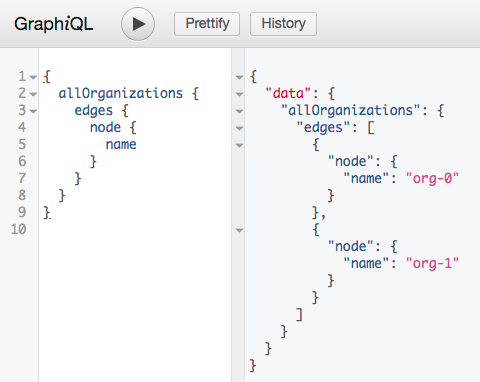

# Example 

* A quick experiment based on [https://graphene-python.org/](https://graphene-python.org/).
* This is based on [graphene-python/graphene-sqlachemy](https://github.com/graphql-python/graphene-sqlalchemy/tree/master/examples/flask_sqlalchemy).

## Packages used
Check out the [Pipefile](Pipfile)

```yaml
[packages]
graphene = "*"
sqlalchemy = "*"
graphene-sqlalchemy = "*"
flask = "*"
flask-graphql = "*"

[dev-packages]
"flake8" = "*"
pytest = "*"
behave = "*"
pytest-bdd = "*"
pytest-flask = "*"
```

## development with pipenv


Use [pipenv](https://pipenv.readthedocs.io/en/latest/) to set up the python virtual environmet.
```bash
$ pipenv sync --dev
```

Use `pipenv run` to run the [pytest](https://docs.pytest.org/en/latest/) tests.

```bash
$ pipenv run pytest
```

Use `pipenv` in [development](https://pipenv.readthedocs.io/en/latest/advanced/#community-integrations).

```bash
$ pipenv shell
$ vim # etc...
```

### testing

Something mildly curious... bdd tests using `pytest-bdd`.
TODO: implement actual bdd tests.

* [bdd_test.feature](tests/features/bdd_test/bdd_test.feature)
* [test_bdd_test.py](tests/bdd_test/test_bdd_test.py)

And pytests to test the graphql.

* [conftest.py](tests/flask/conftest.py)
* [test_graphql_query.py](tests/flask/test_graphql_query.py)

The tests and flask service are hardcoded to use the sqlite db `database.sqlite3`.
The sqlite db was generated using [generate_database.py](generate_database.py).

### running

Use `pipenv` to run the flask app.

```bash
$ pipenv run flask run
```

Goto [http://localhost:5000/graphql](http://localhost:5000/graphql).




## docker

```bash
$ cd docker
$ docker-compose up -d
$ open http://localhost:8080/graphql
```


## OpenShift

Create a new project and template the app from the template:

```bash
$ cd openshift
$ oc new-project poc
$ oc project poc
$ oc process -f template.yaml | oc apply -f -
```

Once the app is deployed, open it in a web browser:

```
$ open http://$(oc get route/graphql-example --template='{{.spec.host}}')/graphql
```

Delete everything created by the template (optional):

```bash
$ oc delete all -l app=graphql-example
```

## Kubernetes

Install the graphql-example in [minikube](https://kubernetes.io/docs/setup/minikube/) using [helm](https://helm.sh/).

First build the image:

```bash
$ cd docker
$ eval "$(minikube docker-env)"
$ docker-compose build
```

Then use helm to install the helm-chart:

```bash
$ cd kubernetes
$ helm install helm-chart
```

Then find the service name and open the url using minikube:

```bash
$ SERVICE_NAME=$(kubectl get service -l app.kubernetes.io/name=helm-chart -o jsonpath="{.items[*].metadata.name}")
$ open "$(minikube service $SERVICE_NAME --url)/graphql"
```

In the graphql ui run the following:

```
{
  allDatasets {
    edges {
      node {
        name
        granules {
          edges {
            node {
              name
            }
          }
        }
      }
    }
  }
}

```

Delete everything that was deployed with the helm-chart

```bash
$ kubectl delete all -l app.kubernetes.io/name=helm-chart
```
